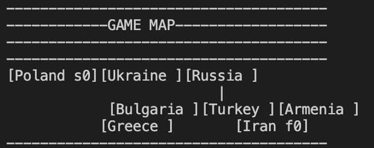
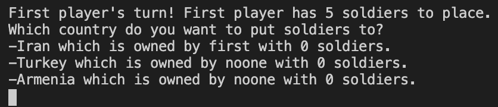
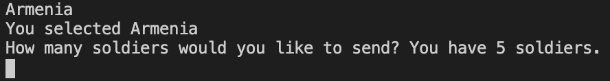
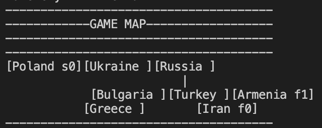

# Mini Risk Game
A mini version of famous strategy game Risk: MiniRiskGame. 

## Game Rules
 There are two players, and 8 countries in this game.
 The first player to own 5 countries wins the game!
 First player,f, starts from Iran while the second player,s, starts from Poland.
 A player can put soldiers on the lands that they own, or they can invade a neighboring land.
 Every turn a player gets new soldiers. The number of soldiers that they get is equal to the half the number of soldiers they did not use last round plus 1.
 If a player tries to invade a country that already has foreign solders on it,players roll one dice each.What they get, gets multiplied with the number of soldiers they have on the land or they are attacking with.Therefore, the more soldiers you have on a country, the more protected it will be.Similarly, if you attack with more soldiers, your attack gets stronger! But, there is always an element of chance, so good luck!!

## Technologies

Java SE 12

## How to Play
This game is played through the console. The status of the game can be tracked via the game map that is printed at the beginning of each turn.  The square brackets around the names of the countries represent the borders. For example, one can go from Poland to Ukraine but cannot travel to Bulgaria from Ukraine since the two countries do not share a border. The letters s (second) and f (first) indicate who owns a particular country. If there is not letter inside a country, this means that this country is not owned by any player yet. The integers written inside the countries demonstrate how many soldiers are placed. Below is how the map looks at the beginning of the game. See that Poland is owned by s with 0 soldiers in it, and Iran is owned by first. 

When it is a player's turn to play, the countries that they can reach are printed on the console. At the beginning of the game, the first player can only reach Iran, which they own, and the countries neighboring Iran: Turkey and Armenia. User is expected to type in the name of the country that they would like to attack: 

After the player choses a country, they need to determine how many soldiers they would like to place. If the country they have chosen is owned by another player, this will be the number of soldiers they attack with!

After this turn ends, another game map is printed. We can see that now the first player also owns Armenia, and they have placed 1 soldier on it. 

## Inspiration
This project was inspired by famous strategy game Risk. 

## Testing
Some of the tests that were used to evaluate MiniRiskGame can be found in the test suite. 

